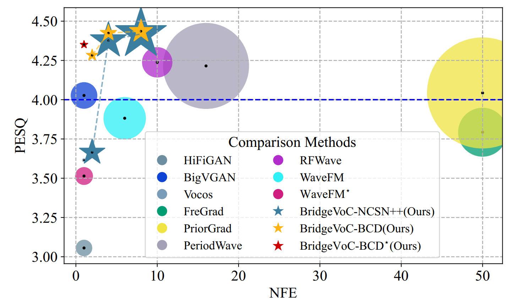
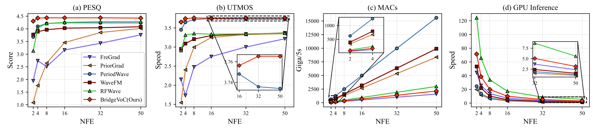

# BridgeVoC
This is the repository for the work "BridgeVoC: Revitalizing Neural Vocoder from a Restoration Perspective". Our conference work has been accepted by IJCAI 2025, and the extension manuscript has been submitted to IEEE Transactions on Pattern Analysis and Machine Intelligence.

### Authors: Andong Li, Tong Lei, Rilin Chen, Kai Li, Meng Yu, Xiaodong Li, Dong Yu, and Chengshi Zheng

## 📌 Key Updates
<details>
  <summary>📅 Full Update History</summary>
  <ul>
    <li><strong>2025.11.04</strong>: Inference code released, pretrained model weights released</li>
    <li><strong>2025.11.03</strong>: Training code released</li>
  </ul>
</details>

## 🔍 Abstract
Despite significant advances in neural vocoders using diffusion models and their variants, these methods, unfortunately, inherently suffer from a performance-inference dilemma, which stems from the iterative nature in the reverse inference
process. This hurdle can heavily hinder the development of this field. To address this challenge, in this paper, we revisit the neural vocoder task through the lens of audio restoration and propose a novel diffusion vocoder called BridgeVoC. Specifically, by rank analysis, we compare the rank characteristics of Mel-spectrum with other common acoustic degradation factors, and cast the vocoder task as a specialized case of audio restoration, where the range-space spectral (RSS) surrogate of the target spectrum serves as the degraded input. Based on that, we introduce the Schrodinger bridge framework for diffusion modeling, which defines the RSS and target spectrum as dual endpoints of the stochastic generation trajectory. Further, to fully utilize the hierarchical prior of subbands in the time-frequency (T-F) domain, we elaborately devise a novel subband-aware convolutional diffusion network as the data predictor, where subbands are divided following an uneven strategy, and convolutional-style attention module is employed with large kernels for efficient T-F contextual modeling. To enable single-step inference, we propose an omnidirectional distillation loss to facilitate effective information transfer from the teacher to student models, and the performance is improved by combining target-related and bijective consistency losses. Comprehensive experiments are conducted on various benchmarks and out-of-distribution datasets. Quantitative and qualitative results show that while enjoying fewer parameters, lower computational cost and competitive inference speed, the proposed BridgeVoC yields state-of-the art performance over existing advanced GAN-, DDPM- and flow-matching-based baselines with only 4 sampling steps. And consistent superiority is still achieved with single-step inference. Training code and demo are available at:
[https://github.com/Andong-Li-speech/BridgeVoC-demo](https://andong-li-speech.github.io/BridgeVoC-demo/).


## ✨ Core Features
<div style="display: grid; grid-template-columns: repeat(auto-fit, minmax(300px, 1fr)); gap: 20px; margin: 30px 0;">
  <div style="background: #f8f9fa; padding: 20px; border-radius: 10px; border-left: 4px solid #3498db;">
    <h3>🎯 Novel formulation</h3>
    <p>Reformulate vocoder task from a restoration perspective via rank analysis.</p>
  </div>

  <div style="background: #f8f9fa; padding: 20px; border-radius: 10px; border-left: 4px solid #e74c3c;">
    <h3>🎧 Light-weight network design</h3>
    <p> 7.65 M • 42.92 GMACs/5s per NFE</p>
  </div>
  
  <div style="background: #f8f9fa; padding: 20px; border-radius: 10px; border-left: 4px solid #2ecc71;">
    <h3>⚡Impressive performance-inference balance</h3>
    <p> The best vocoder performance up to now (e.g., PESQ 4.4+), support for both few- (NFE=4) and single-step setups.</p>
  </div>
</div>


## 🚀 Quick Start

### 1️⃣ Checkpoint Download
Pre-trained models are available on Hugging Face:
 
| Model Name               | Dataset | Sample Rate | NMel | Training Steps |
|--------------------------|---------|-------------|------|----------------|
| 🤗 [BridgeVoC-LibriTTS](https://huggingface.co/AndongLi/BridgeVoC/blob/main/ckpt/Libritts/pretrained/bridgevoc_bcd_libritts_24k_fmax12k_nmel100.pt) | LibriTTS | 24k Hz | 100 | 2M (1M Generator + 1M Discriminator) |
| 🤗 [BridgeVoC-single-step-LibriTTS](https://huggingface.co/AndongLi/BridgeVoC/blob/main/ckpt/Libritts/pretrained/bridgevoc_bcd_single_libritts_24k_fmax12k_nmel100.pt) | LibriTTS | 24k Hz | 100 | 2M (1M Generator + 1M Discriminator) |
| 🤗 [BridgeVoC-LJSpeech](https://huggingface.co/AndongLi/BridgeVoC/blob/main/ckpt/LJS/pretrained/bridgevoc_bcd_ljs_22_05k_fmax_8k_nmel80.pt) | LJSpeech | 22.05k Hz | 80 | 2M (1M Generator + 1M Discriminator) |


### 2️⃣ Inference Examples

Reconstruct audio from mels extracted from original waveforms:
#### Multi-steps (on LibriTTS dev-clean test set for instance)
```bash
python enhancement.py --raw_wav_path /data4/xxx/datasets/LibriTTS/LibriTTS \
                     --test_dir /data4/xxx/datasets/LibriTTS/LibriTTS/dev-clean-other \
                     --enhanced_dir ./test_decode/libritts/bridgevoc\
                     --ckpt ./ckpt/Libritts/pretrained/bridgevoc_bcd_libritts_24k_fmax12k_nmel100.pt \
                     --sde_name bridgegan \
                     --backbone bcd \
                     --device cuda \
                     --nblocks 8 \
                     --hidden_channel 256 \
                     --f_kernel_size 9 \
                     --t_kernel_size 11 \
                     --mlp_ratio 1 \
                     --ada_rank 32 \
                     --ada_alpha 32 \
                     --use_adanorm \
                     --sampling_rate 24000 \
                     --n_fft 1024 \
                     --num_mels 100 \
                     --hop_size 256 \
                     --win_size 1024 \
                     --fmin 0 \
                     --fmax 12000 \
                     --phase_init zero \
                     --spec_factor 0.33 \
                     --spec_abs_exponent 0.5 \
                     --normalize \
                     --transform_type exponent \
                     --beta_min 0.01 \
                     --beta_max 20 \
                     --bridge_type gmax \
                     --N 4 \
                     --sampling_type sde_first_order
                                        
```

#### Single-step (on LibriTTS dev-clean test set for instance)
```bash
CUDA_VISIBLE_DEVICES=0 python enhancement_single.py --raw_wav_path /data4/xxx/datasets/LibriTTS/LibriTTS \
                                                    --test_dir /data4/xxx/datasets/LibriTTS/LibriTTS/dev-clean-other \
                                                    --enhanced_dir ./test_decode/libritts/bridgevoc\
                                                    --ckpt ./ckpt/Libritts/pretrained/bridgevoc_bcd_single_libritts_24k_fmax12k_nmel100.pt \
                                                    --sde_name bridgegan \
                                                    --backbone bcd \
                                                    --device cuda \
                                                    --nblocks 8 \
                                                    --hidden_channel 256 \
                                                    --f_kernel_size 9 \
                                                    --t_kernel_size 11 \
                                                    --mlp_ratio 1 \
                                                    --ada_rank 32 \
                                                    --ada_alpha 32 \
                                                    --use_adanorm \
                                                    --sampling_rate 24000 \
                                                    --n_fft 1024 \
                                                    --num_mels 100 \
                                                    --hop_size 256 \
                                                    --win_size 1024 \
                                                    --fmin 0 \
                                                    --fmax 12000 \
                                                    --phase_init zero \
                                                    --spec_factor 0.33 \
                                                    --spec_abs_exponent 0.5 \
                                                    --normalize \
                                                    --transform_type exponent \
                                                    --beta_min 0.01 \
                                                    --beta_max 20 \
                                                    --bridge_type gmax
```

### 3️⃣ Training 
#### multi-steps on LibriTTS benchmark
```bash
cd starts/train
./train_bridgevoc.sh
```
#### single-step distillation on LibriTTS benchmark
```bash
cd starts/train
./train_bridgevoc_single_step.sh
```

## 📊 Experimental Results

### Performance Comparison
<div style="margin: 20px 0;">
  <h4>🎯 Bubble Figure on LibriTTS Benchmark</h4>
  
</div>

<div style="display: grid; grid-template-columns: 1fr 1fr; gap: 20px; margin: 20px 0;">
  <div>
    <h4>📈 On LibriTTS Benchmark</h4>
    
  </div>
  <div>
    <h4>📈 On LJSpeech Benchmark</h4>
    
  </div>
  <div>
    <h4>📈 On Out-of-Distributions Benchmarks</h4>
    
  </div>
</div>

### Performance vs. Inference Cost
<div style="margin: 20px 0;">
  <h4>🎯 Performance and Inference under different NFEsk</h4>
  
</div>


## 📚 Citation
If you find this work helpful, please cite our paper:
```bibtex
@inproceedings{ijcai2025p0903,
  title     = {BridgeVoC: Neural Vocoder with Schrödinger Bridge},
  author    = {Lei, Tong and Zhang, Zhiyu and Chen, Rilin and Yu, Meng and Lu, Jing and Zheng, Chengshi and Yu, Dong and Li, Andong},
  booktitle = {Proceedings of the Thirty-Fourth International Joint Conference on
               Artificial Intelligence, {IJCAI-25}},
  publisher = {International Joint Conferences on Artificial Intelligence Organization},
  editor    = {James Kwok},
  pages     = {8122--8130},
  year      = {2025},
  month     = {8},
  note      = {Main Track},
  doi       = {10.24963/ijcai.2025/903},
  url       = {https://doi.org/10.24963/ijcai.2025/903},
}
```

## 🤝 Contributing
We welcome contributions! Please feel free to submit issues, fork the repository, and send pull requests.
